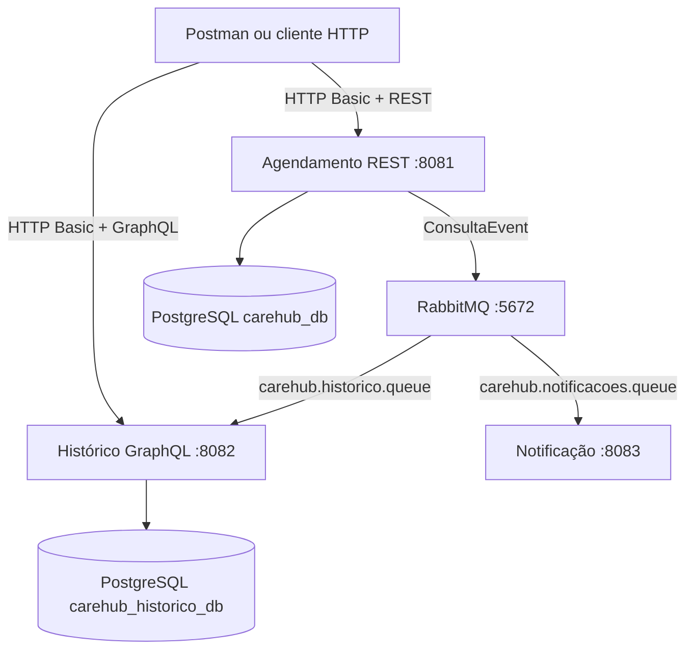

# CareHub API - Tech Challenge Fase 3

Backend modular para agendamento de consultas, consulta do histórico do paciente e geração assíncrona de notificações em um ambiente hospitalar.

Repositório: [github.com/docarmoj/fiap-tech-challenge-fase3](https://github.com/docarmoj/fiap-tech-challenge-fase3)

## Sumário

- [Problema](#problema)
- [Objetivo da aplicação](#objetivo-da-aplicação)
- [Arquitetura](#arquitetura)
- [Serviços](#serviços)
- [Fluxos de comunicação](#fluxos-de-comunicação)
- [Spring Security](#spring-security)
- [Perfis e permissões](#perfis-e-permissões)
- [API REST de agendamento](#api-rest-de-agendamento)
- [API GraphQL de histórico](#api-graphql-de-histórico)
- [Mensageria com RabbitMQ](#mensageria-com-rabbitmq)
- [Persistência](#persistência)
- [Configuração do ambiente](#configuração-do-ambiente)
- [Execução do projeto](#execução-do-projeto)
- [Collection do Postman](#collection-do-postman)
- [Testes](#testes)
- [Estrutura do repositório](#estrutura-do-repositório)

## Problema

Ambientes hospitalares precisam coordenar o agendamento de consultas, controlar o acesso a dados clínicos e avisar pacientes sobre novos compromissos ou alterações. Essas responsabilidades possuem requisitos diferentes: o cadastro da consulta precisa responder imediatamente, o histórico deve permitir consultas flexíveis e as notificações não devem bloquear a operação principal.

Além disso, médicos, enfermeiros e pacientes não podem receber o mesmo nível de acesso. Profissionais precisam consultar e registrar atendimentos, enquanto pacientes devem visualizar somente os próprios dados.

## Objetivo da aplicação

O CareHub implementa um backend simplificado e dividido em serviços para:

- autenticar médicos, enfermeiros e pacientes;
- aplicar autorização por perfil e por vínculo com o paciente;
- criar, alterar, listar e consultar agendamentos;
- manter uma visão de histórico independente do banco de agendamento;
- consultar histórico e atendimentos futuros com GraphQL;
- comunicar criação e alteração de consultas de forma assíncrona;
- gerar notificações sem aumentar o tempo de resposta da API principal.

## Arquitetura

O projeto é um monorepo com três aplicações Spring Boot independentes. Cada serviço possui seu próprio processo, porta e responsabilidade. O serviço de histórico também possui seu próprio banco, evitando leitura direta das tabelas do agendamento.



### Decisões principais

- **Separação por responsabilidade:** agendamento, histórico e notificações evoluem de maneira independente.
- **Comunicação assíncrona:** o agendamento publica um evento e não chama diretamente os consumidores.
- **Banco por serviço:** o histórico mantém uma projeção própria e não consulta o banco do agendamento.
- **REST para comandos operacionais:** criação, alteração e leitura imediata de consultas ficam no serviço de agendamento.
- **GraphQL para leitura flexível:** o cliente escolhe os campos do histórico que deseja receber.
- **Segurança em cada API pública:** agendamento e histórico validam credenciais e permissões separadamente.

### Tecnologias

| Tecnologia | Uso |
| --- | --- |
| Java 21 | linguagem dos três serviços |
| Spring Boot 4.1.0 | inicialização e configuração das aplicações |
| Spring Web MVC | endpoints REST do agendamento |
| Spring Security | autenticação HTTP Basic e autorização |
| Spring Data JPA | acesso aos bancos relacionais |
| Spring for GraphQL | schema e queries do histórico |
| Spring AMQP | publicação e consumo de eventos RabbitMQ |
| RabbitMQ 3 Management | broker e painel administrativo |
| PostgreSQL 16 | persistência de agendamento e histórico |
| Flyway | criação do schema e carga inicial |
| H2 | banco isolado em testes automatizados |
| Docker Compose | infraestrutura local |
| Postman | demonstração e validação dos endpoints |

## Serviços

| Serviço | Porta | Responsabilidade | Entrada | Saída |
| --- | ---: | --- | --- | --- |
| `carehub-agendamento` | `8081` | autenticar usuários e gerenciar consultas | REST | resposta HTTP e evento `ConsultaEvent` |
| `carehub-historico` | `8082` | manter e consultar a projeção do histórico | RabbitMQ e GraphQL | resposta GraphQL |
| `carehub-notificacao` | `8083` | transformar eventos em lembretes | RabbitMQ | log no console |

### Serviço de agendamento

É a fonte principal dos dados de pacientes, profissionais, usuários e consultas. Disponibiliza a API REST, valida os DTOs de entrada, persiste consultas e publica eventos com as ações `CONSULTA_CRIADA` ou `CONSULTA_ALTERADA`.

### Serviço de histórico

Consome os eventos publicados pelo agendamento e grava uma projeção desnormalizada em `tb_consulta_historico`. A coluna `consulta_id` é única. Se um evento da mesma consulta chegar novamente, a linha é atualizada; eventos com `ocorridoEm` anterior ou igual ao já processado são ignorados.

O serviço expõe somente leitura via GraphQL. A carga inicial espelha os dados de demonstração do agendamento, pois essas consultas foram inseridas pelas migrations e não passaram pelo RabbitMQ.

### Serviço de notificações

Consome cada evento da fila de notificações, gera assunto e mensagem e envia o resultado pela implementação `ConsoleNotificacaoSender`. Nesta fase, o envio é representado por um log; não há integração real com e-mail, SMS ou push e não existe endpoint HTTP público nesse serviço.

## Fluxos de comunicação

### Criação ou alteração de consulta

1. Médico ou enfermeiro envia `POST /consultas` ou `PUT /consultas/{id}` com HTTP Basic.
2. Spring Security autentica a credencial e valida o perfil.
3. O serviço de agendamento valida o corpo, consulta paciente e profissional e salva a consulta em `carehub_db`.
4. O agendamento cria um `ConsultaEvent` em JSON e publica no exchange `carehub.consultas.exchange` com a routing key `consulta.evento`.
5. O RabbitMQ entrega uma cópia para `carehub.historico.queue` e outra para `carehub.notificacoes.queue`.
6. O histórico cria ou atualiza sua projeção no banco `carehub_historico_db`.
7. O serviço de notificações cria o lembrete e o registra no console.

### Leitura de consultas pelo REST

1. O cliente acessa o serviço de agendamento.
2. Médicos e enfermeiros recebem todas as consultas.
3. Pacientes recebem apenas registros cujo `pacienteId` corresponde ao vínculo da credencial autenticada.
4. Ao buscar por ID, uma tentativa do paciente de acessar a consulta de outra pessoa resulta em `403 Forbidden`.

### Leitura do histórico pelo GraphQL

1. O cliente envia uma query autenticada para `POST /graphql`.
2. O serviço valida o perfil e, para pacientes, compara o argumento `pacienteId` com o vínculo da credencial.
3. A consulta é executada exclusivamente no banco do histórico.
4. O cliente recebe apenas os campos solicitados no documento GraphQL.

## Spring Security

Os serviços de agendamento e histórico usam a mesma estratégia de segurança:

- autenticação **HTTP Basic**;
- política de sessão `STATELESS`;
- CSRF desabilitado, pois não há autenticação baseada em sessão ou cookie;
- usuários carregados de `tb_usuario` por uma implementação de `UserDetailsService`;
- senhas armazenadas como hash BCrypt com prefixo `{bcrypt}`;
- autoridade gerada no formato `ROLE_MEDICO`, `ROLE_ENFERMEIRO` ou `ROLE_PACIENTE`;
- autorização de método habilitada com `@EnableMethodSecurity` e aplicada por `@PreAuthorize`;
- usuário inativo rejeitado por `UserDetails.isEnabled()`;
- `pacienteId` e `profissionalId` copiados para o principal autenticado para as regras de domínio.

Toda requisição protegida deve enviar o cabeçalho:

```http
Authorization: Basic <base64(usuario:senha)>
```

Exemplo com cURL:

```bash
curl --user medico1:123456 http://localhost:8081/usuarios/me
```

### Respostas de segurança

| Situação | Resultado |
| --- | --- |
| credencial ausente, inválida ou usuário inativo | `401 Unauthorized`, `WWW-Authenticate: Basic` e `application/problem+json` |
| usuário autenticado sem permissão REST | `403 Forbidden` e `application/problem+json` |
| paciente solicita dados de outro paciente no GraphQL | HTTP `200`, `data: null` e erro com classificação `FORBIDDEN` |

## Perfis e permissões

| Operação | Médico | Enfermeiro | Paciente |
| --- | :---: | :---: | :---: |
| consultar a própria identidade | sim | sim | sim |
| listar consultas | todas | todas | somente próprias |
| buscar consulta por ID | qualquer consulta | qualquer consulta | somente própria |
| criar consulta | sim | sim | não |
| alterar consulta | sim | sim | não |
| consultar histórico | qualquer paciente | qualquer paciente | somente o próprio |
| consultar atendimentos futuros | qualquer paciente | qualquer paciente | somente os próprios |

A autorização possui duas camadas. `@PreAuthorize` valida o papel necessário para entrar no método. Em seguida, `AutorizacaoService` aplica a regra de propriedade para impedir que um paciente leia dados de outro paciente.

## API REST de agendamento

Base URL local: `http://localhost:8081`

Todos os endpoints exigem HTTP Basic.

| Método | Endpoint | Perfis | Sucesso | Descrição |
| --- | --- | --- | --- | --- |
| `GET` | `/usuarios/me` | todos | `200` | retorna usuário, perfil e IDs vinculados |
| `GET` | `/consultas` | todos | `200` | profissionais veem tudo; paciente recebe somente seus registros |
| `GET` | `/consultas/{id}` | todos | `200` | busca uma consulta e aplica a regra de propriedade |
| `POST` | `/consultas` | médico, enfermeiro | `201` | cria uma consulta com status inicial `AGENDADA` |
| `PUT` | `/consultas/{id}` | médico, enfermeiro | `200` | substitui os dados editáveis da consulta |

### Identidade autenticada

```bash
curl --user paciente1:123456 http://localhost:8081/usuarios/me
```

Resposta de exemplo:

```json
{
  "username": "paciente1",
  "role": "PACIENTE",
  "pacienteId": 1,
  "profissionalId": null
}
```

### Criar consulta

```bash
curl --request POST \
  --url http://localhost:8081/consultas \
  --user medico1:123456 \
  --header "Content-Type: application/json" \
  --data '{
    "pacienteId": 1,
    "profissionalId": 1,
    "dataHora": "2030-12-01T09:00:00",
    "observacoes": "Consulta criada para demonstração"
  }'
```

### Alterar consulta

O `PUT` exige o corpo completo e um dos status `AGENDADA`, `REALIZADA` ou `CANCELADA`.

```bash
curl --request PUT \
  --url http://localhost:8081/consultas/5 \
  --user enfermeiro1:123456 \
  --header "Content-Type: application/json" \
  --data '{
    "pacienteId": 1,
    "profissionalId": 1,
    "dataHora": "2030-12-02T14:00:00",
    "status": "REALIZADA",
    "observacoes": "Consulta atualizada"
  }'
```

Resposta de consulta:

```json
{
  "id": 5,
  "pacienteId": 1,
  "pacienteNome": "Joao Silva",
  "profissionalId": 1,
  "profissionalNome": "Dr. Carlos Eduardo",
  "dataHora": "2030-12-02T14:00:00",
  "status": "REALIZADA",
  "observacoes": "Consulta atualizada"
}
```

### Validações e erros REST

- `pacienteId`, `profissionalId` e `dataHora` são obrigatórios;
- `dataHora` deve estar no futuro tanto na criação quanto na atualização;
- `status` é obrigatório na atualização;
- `observacoes` aceita no máximo 1.000 caracteres;
- paciente ou profissional inexistente resulta em `404 Not Found`;
- consulta inexistente resulta em `404 Not Found`;
- corpo inválido resulta em `400 Bad Request` com os erros por campo;
- acesso sem autenticação resulta em `401 Unauthorized`;
- perfil sem permissão ou acesso a dados de outro paciente resulta em `403 Forbidden`.

Exemplo de erro de validação:

```json
{
  "type": "about:blank",
  "title": "Erro de validação",
  "status": 400,
  "detail": "A requisição contém campos inválidos.",
  "instance": "/consultas",
  "errors": {
    "dataHora": "dataHora deve estar no futuro"
  }
}
```

## API GraphQL de histórico

- Endpoint: `POST http://localhost:8082/graphql`
- Interface GraphiQL: `http://localhost:8082/graphiql`
- Autenticação: HTTP Basic
- Scalar de data: `DateTime`, no formato `yyyy-MM-dd'T'HH:mm:ss`
- Status aceitos: `AGENDADA`, `REALIZADA` e `CANCELADA`

### Queries disponíveis

| Query | Argumentos | Ordenação | Resultado |
| --- | --- | --- | --- |
| `historicoPorPaciente` | `pacienteId: ID!`, `status: StatusConsulta` opcional | mais recente primeiro | todos os atendimentos do paciente |
| `consultasFuturasPorPaciente` | `pacienteId: ID!`, `status: StatusConsulta` opcional | mais próximo primeiro | atendimentos com `dataHora` posterior ao momento atual |

### Consultar histórico

```graphql
query {
  historicoPorPaciente(pacienteId: "1") {
    id
    dataHora
    status
    observacoes
    paciente {
      id
      nome
    }
    profissional {
      id
      nome
    }
  }
}
```

### Consultar somente atendimentos futuros e agendados

```graphql
query {
  consultasFuturasPorPaciente(
    pacienteId: "1"
    status: AGENDADA
  ) {
    id
    dataHora
    status
  }
}
```

Exemplo por cURL:

```bash
curl --request POST \
  --url http://localhost:8082/graphql \
  --user paciente1:123456 \
  --header "Content-Type: application/json" \
  --data '{"query":"query { historicoPorPaciente(pacienteId: \"1\") { id dataHora status } }"}'
```

O paciente só pode informar seu próprio ID. Médicos e enfermeiros podem consultar qualquer paciente. Em GraphQL, uma falha de autorização ocorrida durante a resolução da query segue o padrão da tecnologia: a resposta HTTP pode ser `200`, mas o corpo contém `errors` e não entrega os dados protegidos.

## Mensageria com RabbitMQ

O RabbitMQ desacopla a gravação principal dos consumidores de histórico e notificação. O serviço de agendamento publica uma única mensagem, e duas filas recebem cópias independentes por estarem vinculadas ao mesmo direct exchange e à mesma routing key.

### Topologia

| Recurso | Nome | Função |
| --- | --- | --- |
| direct exchange | `carehub.consultas.exchange` | recebe eventos de consulta |
| routing key | `consulta.evento` | direciona eventos para as filas principais |
| fila | `carehub.historico.queue` | consumo pelo histórico |
| fila | `carehub.notificacoes.queue` | consumo pelas notificações |
| dead-letter exchange | `carehub.consultas.dlx` | recebe mensagens rejeitadas |
| DLQ | `carehub.historico.dlq` | falhas definitivas do histórico |
| DLQ | `carehub.notificacoes.dlq` | falhas definitivas da notificação |

Filas e exchanges são duráveis. Os consumidores usam conversão JSON. Histórico e notificações possuem retry com intervalo inicial de 1 segundo, multiplicador `2`, intervalo máximo de 10 segundos e até 3 tentativas. Depois das tentativas, a mensagem rejeitada segue para a DLQ correspondente, sem requeue infinito.

### Contrato do evento

```json
{
  "consultaId": 5,
  "pacienteId": 1,
  "nomePaciente": "Joao Silva",
  "emailPaciente": "joao.silva@email.com",
  "profissionalId": 1,
  "nomeProfissional": "Dr. Carlos Eduardo",
  "dataHora": "2030-12-01T09:00:00",
  "status": "AGENDADA",
  "observacoes": "Consulta criada para demonstração",
  "acao": "CONSULTA_CRIADA",
  "ocorridoEm": "2026-09-06T20:00:00"
}
```

O histórico utiliza todos os campos necessários para construir sua projeção. A notificação utiliza o ID, os dados do paciente, a data e a ação para montar a mensagem. Campos adicionais do JSON podem ser ignorados pelo consumidor.

Painel local do RabbitMQ: `http://localhost:15672`

- usuário: `guest`
- senha: `guest`

## Persistência

O container PostgreSQL disponibiliza dois bancos:

| Banco | Serviço proprietário | Conteúdo |
| --- | --- | --- |
| `carehub_db` | agendamento | pacientes, profissionais, usuários e consultas |
| `carehub_historico_db` | histórico | usuários do serviço e projeção das consultas |

O script `docker/postgres-init/01-create-historico-db.sql` cria o segundo banco na primeira inicialização do PostgreSQL. Cada serviço executa suas próprias migrations Flyway ao iniciar:

- `V1__create_tables.sql`: cria tabelas, constraints e índices;
- `V2__insert_initial_data.sql`: insere dados e credenciais de demonstração.

`spring.jpa.hibernate.ddl-auto` está configurado como `none`; portanto, o schema é controlado pelo Flyway e não pelo Hibernate.

## Configuração do ambiente

### Pré-requisitos

- Git;
- Java JDK 21;
- Docker Desktop ou Docker Engine com Docker Compose;
- Postman, opcional para executar a Collection.

O Maven não precisa ser instalado globalmente, pois cada serviço contém Maven Wrapper.

### Portas locais

| Componente | Porta | Protocolo |
| --- | ---: | --- |
| PostgreSQL | `5432` | TCP |
| RabbitMQ | `5672` | AMQP |
| RabbitMQ Management | `15672` | HTTP |
| Agendamento | `8081` | HTTP |
| Histórico | `8082` | HTTP |
| Notificação | `8083` | HTTP interno, sem endpoint de negócio |

### Configuração padrão

| Recurso | Usuário | Senha |
| --- | --- | --- |
| PostgreSQL | `postgres` | `postgres` |
| RabbitMQ | `guest` | `guest` |

As configurações ficam nos arquivos `application.yaml` de cada módulo. Propriedades Spring Boot também podem ser sobrescritas por variáveis de ambiente, por exemplo:

- `SERVER_PORT`;
- `SPRING_DATASOURCE_URL`;
- `SPRING_DATASOURCE_USERNAME`;
- `SPRING_DATASOURCE_PASSWORD`;
- `SPRING_RABBITMQ_HOST`;
- `SPRING_RABBITMQ_PORT`;
- `SPRING_RABBITMQ_USERNAME`;
- `SPRING_RABBITMQ_PASSWORD`;
- `CAREHUB_RABBITMQ_EXCHANGE`;
- `CAREHUB_RABBITMQ_ROUTINGKEY`;
- `CAREHUB_RABBITMQ_QUEUE`;
- `CAREHUB_RABBITMQ_DLX`;
- `CAREHUB_RABBITMQ_DLQ`;
- `CAREHUB_RABBITMQ_DLQROUTINGKEY`.

### Credenciais de demonstração

Todos os usuários da carga inicial usam a senha `123456`.

| Usuário | Perfil | Vínculo | Situação |
| --- | --- | --- | --- |
| `medico1` | `MEDICO` | profissional 1 | ativo |
| `enfermeiro1` | `ENFERMEIRO` | profissional 2 | ativo |
| `paciente1` | `PACIENTE` | paciente 1 | ativo |
| `paciente2` | `PACIENTE` | paciente 2 | ativo |
| `inativo1` | `PACIENTE` | paciente 3 | inativo, usado no cenário `401` |

Essas credenciais existem apenas para demonstração local e não devem ser reutilizadas em produção.

## Execução do projeto

### 1. Clonar o repositório

```bash
git clone https://github.com/docarmoj/fiap-tech-challenge-fase3.git
cd fiap-tech-challenge-fase3
```

### 2. Subir PostgreSQL e RabbitMQ

```bash
docker compose up -d
docker compose ps
```

Aguarde os containers iniciarem antes de executar os serviços.

### 3. Iniciar as aplicações

Abra três terminais na raiz do repositório.

Linux ou macOS:

```bash
cd carehub-agendamento
bash mvnw spring-boot:run
```

```bash
cd carehub-historico
bash mvnw spring-boot:run
```

```bash
cd carehub-notificacao
bash mvnw spring-boot:run
```

Windows PowerShell:

```powershell
cd carehub-agendamento
.\mvnw.cmd spring-boot:run
```

```powershell
cd carehub-historico
.\mvnw.cmd spring-boot:run
```

```powershell
cd carehub-notificacao
.\mvnw.cmd spring-boot:run
```

Na primeira execução, o Maven Wrapper baixa o Maven e as dependências. Os serviços também executam as migrations automaticamente.

### 4. Verificar a execução

```bash
curl --user medico1:123456 http://localhost:8081/usuarios/me
```

Também é possível abrir:

- GraphiQL: `http://localhost:8082/graphiql`;
- RabbitMQ Management: `http://localhost:15672`.

### 5. Encerrar a infraestrutura

Depois de interromper os processos Java:

```bash
docker compose down
```

## Collection do Postman

Arquivos exportados no repositório:

- [`docs/carehub.postman_collection.json`](docs/carehub.postman_collection.json);
- [`docs/carehub-local.postman_environment.json`](docs/carehub-local.postman_environment.json);
- [`docs/POSTMAN.md`](docs/POSTMAN.md), com instruções detalhadas.

### Importar e executar

1. Inicie PostgreSQL, RabbitMQ, agendamento e histórico.
2. No Postman, selecione **Import**.
3. Importe a Collection e o Environment indicados acima.
4. Selecione o Environment **CareHub - Local** no canto superior direito.
5. Execute requisições individuais ou abra a Collection e escolha **Run collection**.
6. No Runner, mantenha a ordem original.

A ordem da pasta `Matriz de autorizacao` é relevante: `MEDICO cria consulta` salva o ID retornado na variável `consultaCriada`, e a requisição seguinte usa esse ID para validar o `PUT`.

A Collection contém testes automáticos para:

- ausência de credencial, senha incorreta e usuário inativo;
- identificação como médico, enfermeiro e paciente;
- listagem e busca conforme cada perfil;
- criação e alteração de consulta;
- isolamento dos dados do paciente;
- acessos negados com `401` e `403`;
- consulta inexistente com `404`;
- histórico e atendimentos futuros via GraphQL;
- filtro por status e validação do contrato GraphQL.

O resultado esperado no Runner é que todos os testes fiquem verdes, inclusive os casos que esperam erros de segurança.

## Testes

Cada serviço possui testes automatizados próprios. Para executá-los:

Linux ou macOS:

```bash
cd carehub-agendamento
bash mvnw test
```

```bash
cd carehub-historico
bash mvnw test
```

```bash
cd carehub-notificacao
bash mvnw test
```

No Windows, substitua `bash mvnw` por `.\mvnw.cmd`.

Os testes cobrem contexto Spring, autenticação, autorização, controllers REST, GraphQL, publicação e consumo de eventos, deserialização e geração de notificações.

## Estrutura do repositório

```text
fiap-tech-challenge-fase3/
├── carehub-agendamento/       # API REST e publicação de eventos
├── carehub-historico/         # consumidor, banco próprio e GraphQL
├── carehub-notificacao/       # consumidor e envio de lembrete no console
├── docker/postgres-init/      # criação do banco de histórico
├── docs/                      # Collection, Environment e guia do Postman
├── scripts/                   # geração do relatório técnico
├── docker-compose.yml         # PostgreSQL e RabbitMQ
└── README.md                  # documentação principal
```

## Relatório técnico

O repositório também contém o relatório da Fase 3 em Markdown, HTML e PDF:

- `Relatorio Tecnico - CareHub API - Fase 3.md`;
- `Relatorio Tecnico - CareHub API - Fase 3.html`;
- `Relatorio Tecnico - CareHub API - Fase 3.pdf`.

No Windows, o relatório pode ser regenerado com:

```powershell
powershell -ExecutionPolicy Bypass -File .\scripts\build-report.ps1
```
